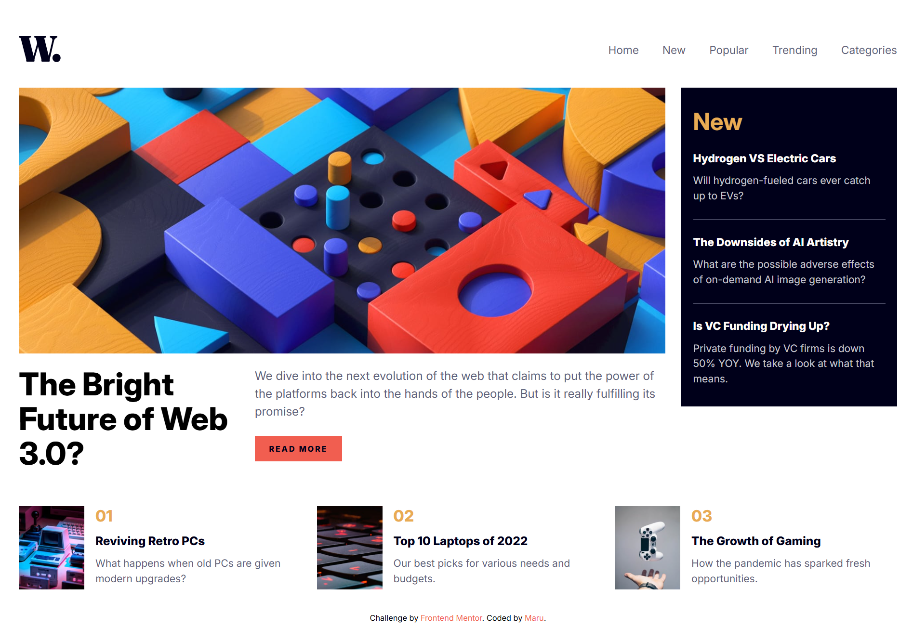
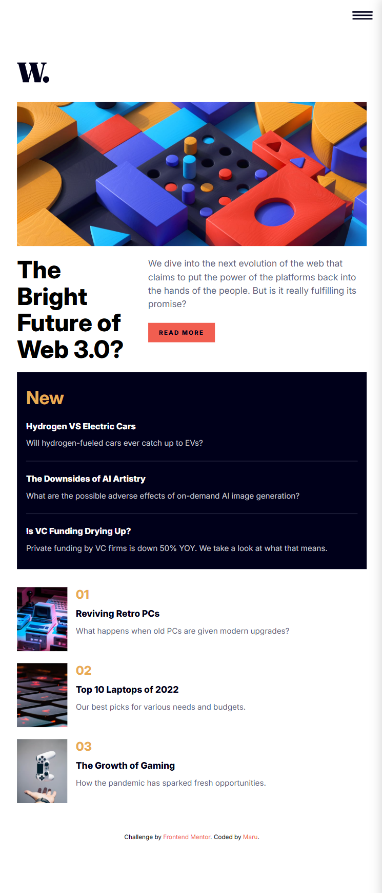
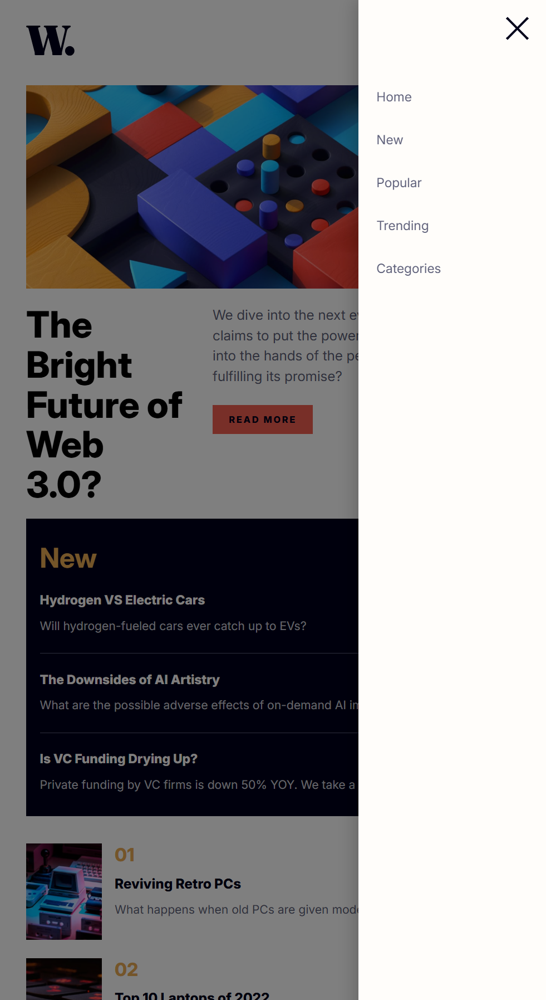

# Frontend Mentor - News homepage


This is a solution to the [News homepage challenge on Frontend Mentor](https://www.frontendmentor.io/challenges/news-homepage-H6SWTa1MFl). Frontend Mentor challenges help you improve your coding skills by building realistic projects.

## Table of contents

- [Overview](#overview)
  - [The challenge](#the-challenge)
  - [Screenshot](#screenshot)
  - [Links](#links)
- [My process](#my-process)
  - [Built with](#built-with)
  - [What I learned](#what-i-learned)
  - [Continued development](#continued-development)
- [Author](#author)

## Overview

### The challenge

Users should be able to:

- View the optimal layout for the interface depending on their device's screen size
- See hover and focus states for all interactive elements on the page

### Screenshot







### Links

- Solution URL: [Add solution URL here](https://www.frontendmentor.io/solutions/contact-form-f4VS4oLtD0)
- Live Site URL: [Add live site URL here](https://contact-form-tawny.vercel.app/)

## My process

### Built with

- Semantic HTML5 markup
- CSS custom properties
- Flexbox
- JavaScript

### What I learned

- I implemented a hamburger menu for mobile navigation, including an overlay background that appears when the menu is open.
- I got a deeper understanding of when to use flex and when to use grid, especially for combining horizontal and vertical layouts.
- Adjusting spacing and alignment in sidebar components taught me more about managing white space with both flexbox and padding/margin.

```CSS
  .nav-links {
    position: fixed;
    right: 0;
    top: 0;
    height: 100vh;
    width: 250px;
    background: var(--off-white);
    flex-direction: column;
    padding: 10rem 2rem;
    box-shadow: -4px 0 24px rgba(0, 0, 0, 0.2);
    transform: translateX(100%);
    transition: transform 0.3s;
    z-index: 10;
    justify-content: start;
  }

  .nav-links.open {
    transform: translateX(0);
  }

  .menu-btn-open.open {
    display: none;
  }

  .menu-btn-open {
    display: block;
    position: absolute;
    right: 2rem;
    top: 2rem;
    z-index: 20;
    cursor: pointer;
  }

  .menu-btn-close {
    position: absolute;
    right: 2rem;
    top: 2rem;
    z-index: 20;
    cursor: pointer;
  }

  .menu-btn-close.close {
    display: block;
  }

  .overlay {
    position: fixed;
    inset: 0;
    background: rgba(0, 0, 0, 0.5);
    z-index: 5;
    pointer-events: none;
    opacity: 0;
    transition: opacity 0.3s;
  }

  .nav-links.open ~ .overlay {
    pointer-events: auto;
    opacity: 1;
  }
```

### Continued development

- Enhancing the UI/UX with animations or smoother error messaging.
- Toggle between light and dark themes

## Author

- Frontend Mentor - [@zerowater](https://www.frontendmentor.io/profile/zerowater4704)
- Twitter - [@jnyngxi188584](https://www.x.com/jnyngxi188584)
